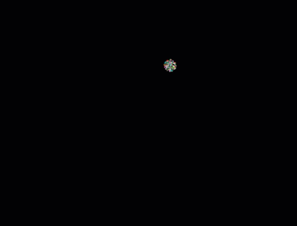

# Point Cloud Super Nova Animation

An experiment animating an explosion of points using three.js.    
Built using three.js, TypeScript, WebPack and [CodeMix for Eclipse](https://www.genuitec.com/products/codemix/).

